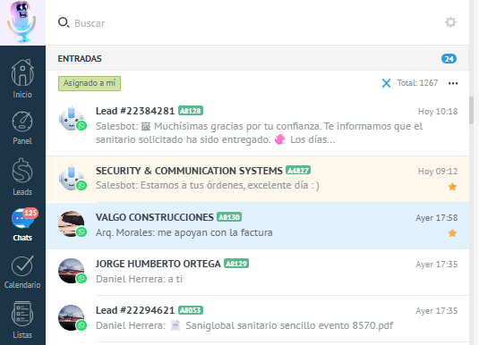
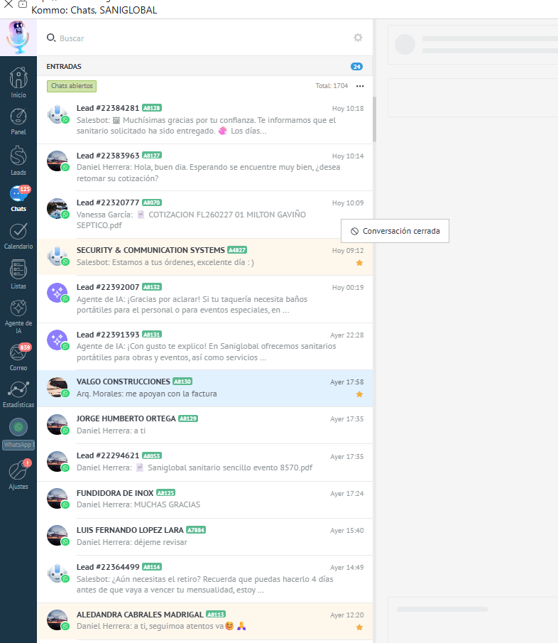
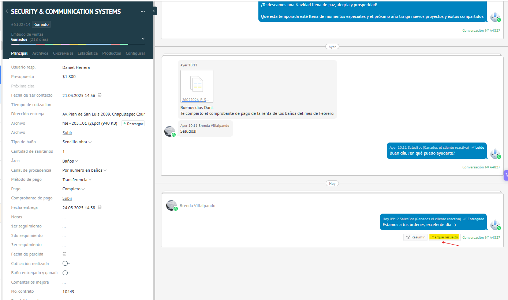
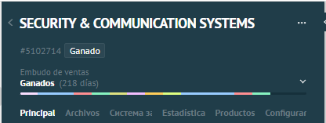
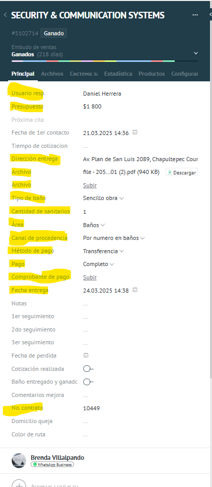
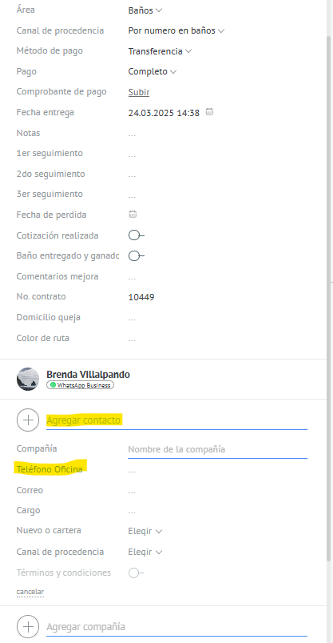
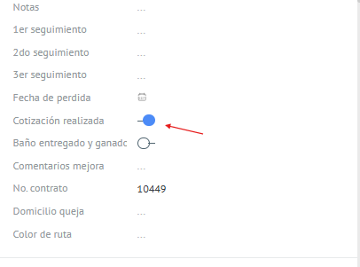
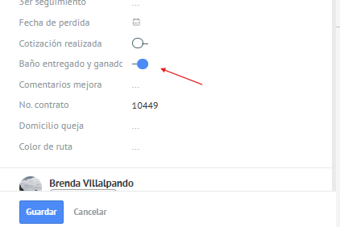
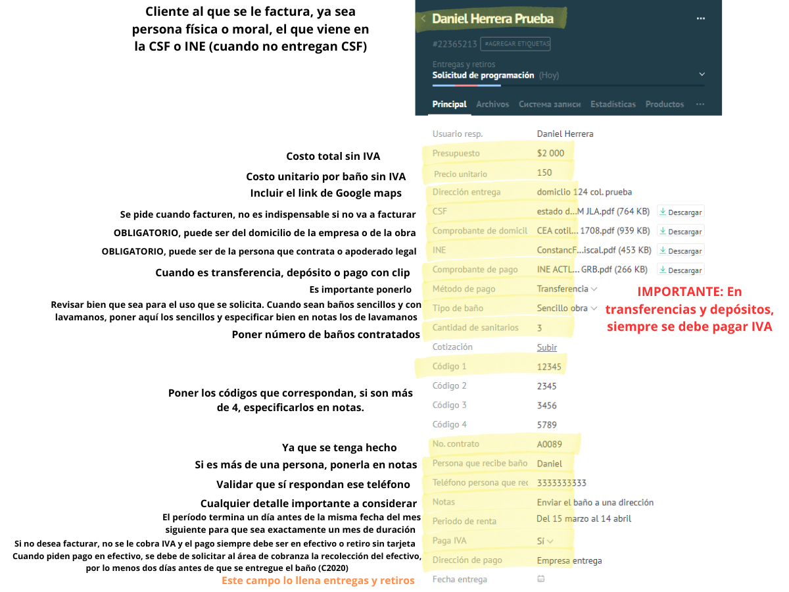
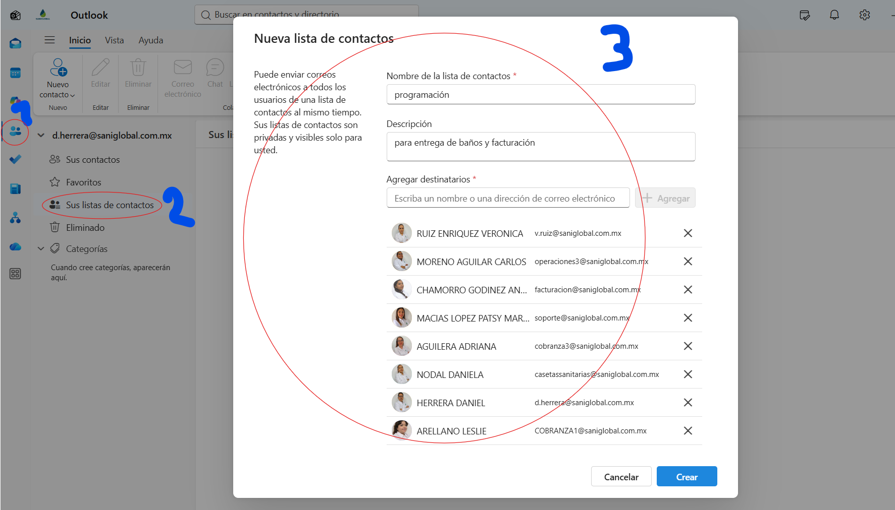

# 📘 Guía de Capacitación: Cómo Funciona Nuestro Sistema de Ventas en Kommo

**Para:** Equipo de Ventas y Atención al Cliente  
**Plataforma:** Kommo CRM + WhatsApp / Meta  
**Última actualización:** Junio 2026

---

> [!IMPORTANT]
> **"El Embudo GPT Completo es el origen de todo."** Todos los prospectos entran por ahí primero, y desde ahí el sistema los canaliza al área correspondiente. Como nuestro equipo se divide por especialidades, esta guía está estructurada para que cada asesor consulte únicamente lo que le corresponde, además de contar con una sección de reglas generales de uso obligatorio para todos.

---

## 📌 Tabla de Contenidos

### ⚙️ PARTE I: BASES GENERALES (Para todo el equipo)
1. [Glosario rápido: términos clave](#glosario)
2. [El Embudo GPT Completo: El Origen de todo](#gpt-completo)
3. [Reglas de Operación Diaria (Meta, Asignación, etc.)](#reglas-operacion)
4. [Embudos de Soporte y Regla Especial de Quejas](#embudos-soporte)

### 🚽 SECCIÓN II: RENTA DE BAÑOS PORTÁTILES
* **Vendedor Responsable:** Daniel Herrera (Usuario 12824423)
* [Flujo y 18 etapas del Embudo de Ventas (Baños)](#seccion-baños)
* [Secuencia de preguntas del Bot de Renta](#preguntas-baños)
* [Gestión de Clientes Activos (Ganados, Reactivaciones y Retiros)](#clientes-activos-baños)

### 🌀 SECCIÓN III: SERVICIOS ESPECIALES Y FOSAS SÉPTICAS
* **Vendedora Responsable:** Livier Mora (Usuario 13346199)
* [Flujo y 13 etapas del Embudo de Fosas](#seccion-fosas)
* [Secuencia de preguntas del Bot de Fosas](#preguntas-fosas)
* [Filtro crítico de Casa Habitación (Exclusión)](#filtro-fosas)
* [Visita de Diagnóstico y Seguimiento](#seguimiento-fosas)

### 🍳 SECCIÓN IV: TRAMPAS DE GRASA
* **Vendedor Responsable:** Asesor de Trampas de Grasa
* [Flujo y 11 etapas del Embudo de Trampas](#seccion-trampas)
* [Secuencia de preguntas del Bot de Trampas](#preguntas-trampas)
* [Cotización Automática vs. Cotización Manual](#cotizacion-trampas)

---

<a name="glosario"></a>
## ⚙️ PARTE I: BASES GENERALES (Para todo el equipo)

### 1. 📖 Glosario Rápido

Antes de entrar de lleno, aquí están los términos que usamos constantemente:

| Término | Qué significa |
|---|---|
| **Lead / Prospecto** | Cualquier persona o empresa que nos contacta por primera vez a través de nuestros canales digitales |
| **Embudo (Pipeline)** | El "camino" o proceso de ventas estructurado en etapas secuenciales por el que transita un prospecto |
| **Etapa (Estatus)** | La fase específica de negociación en la que se encuentra el cliente dentro de un embudo |
| **Bot / Automatización** | Mensajes y acciones lógicas ejecutadas por el sistema sin intervención humana |
| **Etiqueta (Tag)** | Marcas de color añadidas a la tarjeta del cliente para filtrado rápido, campañas o disparar automatizaciones |
| **Webhook** | Solicitud HTTP automática para enviar datos a microservicios externos (ej. cotizadores automáticos) |
| **Ventana de 24h** | Regla de Meta que limita el envío de mensajes libres a 24 horas desde la última interacción del usuario |
| **Mensaje rápido** | Plantillas de texto predefinidas en Kommo que se invocan con la tecla '/' para agilizar la comunicación |
| **Casa Habitación** | Etiqueta y filtro aplicado por el bot para descartar y cerrar solicitudes residenciales no viables en fosas |

---

<a name="gpt-completo"></a>
### 2. 🌟 El Embudo GPT Completo — El Origen de Todo

Cuando alguien nos escribe por primera vez —sea por WhatsApp, Facebook o Instagram— su conversación aterriza automáticamente aquí. Este bot es el **recepcionista virtual de la empresa**. Se llama "GPT Completo" porque usa inteligencia artificial para entender lo que el cliente escribe y guiarlo por el camino correcto.

**Lo primero que hace el bot** es presentarse y preguntar:

> *"Mucho gusto, ¿en qué te podemos servir hoy? ¿Te interesa rentar un baño portátil o buscas algún servicio especializado como limpieza de fosas sépticas, trampas de grasa, recolección de residuos?"*

El cliente tiene tres botones para elegir:
- 🚽 **Rentar baños** → El bot lo mueve al **Embudo de Ventas (Baños)** y lo asigna a Daniel Herrera.
- 🔧 **Servicios especiales** → El bot lo mueve al **Embudo de Servicios Especiales (Fosas)** y lo asigna a Livier Mora.
- 💬 **Otro asunto** → El bot lo mueve al **Embudo de Otros Asuntos**.

> [!NOTE]
> Si el cliente escribe en lugar de usar un botón (ej. "renta de sanitarios" o "limpieza de fosa"), el sistema intenta detectarlo y enviarlo al embudo correcto automáticamente. Si no puede clasificarlo, lo pasa a soporte humano.

#### ¿Qué pasa si el cliente no responde?
El bot espera **61 minutos**. Si no hay respuesta, pregunta si prefiere recibir una llamada. Si tampoco responde, espera **5 horas**, manda un mensaje de despedida cordial y espera **24 horas**. Si en ese tiempo no hay reacción, el sistema le pone la etiqueta **"Sin respuesta"** y cierra la conversación automáticamente.

---

<a name="reglas-operacion"></a>
### 3. 🛠️ Reglas de Operación Diaria

#### ⏱️ La Regla de las 24 Horas de Meta
Meta (WhatsApp, Facebook, Instagram) solo permite responder libremente dentro de las **24 horas posteriores al último mensaje del cliente**. 
- Si la ventana se cierra, no puedes enviar mensajes libres.
- Para reabrirla, debes enviar una **Plantilla HSM aprobada** (tiene costo).
- Por esto, nuestros bots de seguimiento operan a las **21 horas** para enviar el recordatorio antes de que expire la ventana.
- **Tu deber:** Responde rápido. No dejes conversaciones abiertas de un día para otro si están a punto de expirar.

#### 👤 Asignación de Leads a Otro Usuario
Cada lead tiene un asesor asignado. Si necesitas transferirlo (por carga de trabajo o territorio):
- Ve a la tarjeta del lead, busca el campo "Responsable" y cámbialo al usuario correcto.
- Guarda los cambios. El sistema le notificará automáticamente y reasignará las tareas pendientes.
- ⚠️ **REGLA DE ORO DE ASIGNACIÓN:** Cuando reasignes una oportunidad a un compañero porque te llegó a ti por error, **debes dejar obligatoriamente una nota** en la tarjeta con cualquier dato extra, comentario o necesidad que el cliente ya te haya compartido en el chat anterior. Esto evita la pérdida de información y facilita el trabajo del nuevo asesor asignado.

#### 💬 Gestión de la Bandeja de Entrada (Filtros y Cierre de Chats)
Para mantener un CRM ordenado y dar atención oportuna, se deben seguir las siguientes directrices en la bandeja de entrada:
1. **Filtro de Asignación Obligatorio:** Siempre debes tener activo el filtro **"Asignado a mí"** en tu sección de chats para visualizar únicamente tus leads y evitar interferencias o dobles atenciones.
   
   
   
2. **Control de Conversaciones Abiertas:** No se debe dejar la sección de chats (entradas) con más de **10 conversaciones abiertas** al mismo tiempo.
3. **Cerrar sin Eliminar Tareas (Conversación Cerrada):** Para quitar un lead de la sección de chats activos sin alterar sus tareas internas, haz clic en los 3 puntos debajo del horario del chat y selecciona **"conversación cerrada"**. Esto despeja tu buzón sin eliminar recordatorios.
   
   
   
4. **Marcar como Resuelto (Cierre Definitivo):** Para cerrar una conversación y además eliminar todas las tareas pendientes porque el lead ya concluyó su proceso o fue descartado, da clic en el botón **"Marque resuelto"** dentro de la conversación.
   
   
   
   > [!NOTE]
   > Cerrar una conversación o marcarla como resuelta **no cambia el embudo ni elimina el historial** del cliente; únicamente sirve para despejar tu bandeja y dar prioridad a los prospectos en proceso activo de cotización o renta.

#### 📇 Llenado Correcto de la Tarjeta del Lead (Datos Obligatorios)
La tarjeta del cliente es nuestro expediente comercial oficial. Debe llenarse de forma completa y estandarizada:
1. **Nombre del Cliente/Empresa:** La tarjeta del lead siempre debe tener el nombre de la empresa o del cliente hasta arriba (en el encabezado principal).
   
   
   
2. **Información Crítica Requerida:** Cada lead que avance en negociación debe contar obligatoriamente con los siguientes campos llenos en su tarjeta:
   - Por lo menos una etiqueta (tag) del servicio requerido.
   - Presupuesto (ingresado sin IVA).
   - Dirección de entrega completa.
   - Archivos adjuntos en PDF de: **Constancia de Situación Fiscal (CSF)** e **INE** (o comprobante de domicilio si es particular).
   - Tipo de baño y cantidad de sanitarios solicitados.
   - Área geográfica (cobertura) y canal de procedencia del cliente.
   - Método de pago, estatus del pago y comprobante de pago adjunto (si aplica).
   - Fecha de entrega requerida y número de contrato.
   
   
   
3. **Contacto del Receptor en Sitio:** Es obligatorio agregar en los campos inferiores el **nombre y número de teléfono de la persona física que recibirá el sanitario en sitio**, sin importar que sea el mismo contacto del contratante. Este dato es vital para agilizar la logística de entregas y retiros de operaciones.
   
   

#### 🖱️ Botones Manuales de Automatización
Los bots comerciales se basan en disparadores que tú debes activar manualmente al dar clics obligatorios en los siguientes botones dentro de la tarjeta:
1. **Cotización realizada:** Haz clic aquí de forma obligatoria en cuanto envíes la cotización formal en PDF al cliente. El sistema le enviará automáticamente un mensaje informativo predefinido en el chat (no necesitas escribir texto de acompañamiento) y programará el bot de seguimiento de 21h.
   
   
   
2. **Baño entregado y ganado:** Haz clic aquí una vez que el área de entregas y retiros te confirme la entrega física del baño. El bot le enviará automáticamente al cliente la información post-venta sobre su renta (reglas de uso, mantenimiento y qué procede a partir de ese momento).
   
   

#### ⚡ Mensajes Rápidos
Escribe `/` (diagonal) en el chat para buscar plantillas predefinidas. Úsalas para saludos, cuentas de pago o preguntas frecuentes y mantén la consistencia profesional del equipo.

#### 📬 Proceso Obligatorio de Programación y Envío a Facturación/Operaciones
Cuando un lead está calificado y listo para entrega, el paso de ventas a operaciones debe seguir estrictamente este flujo formal:
1. **Mover a Solicitud de Programación:** Asegúrate de que toda la información crítica y documentos estén completos en la tarjeta. Mueve el lead al embudo de **Entregas y Retiros** en la etapa **Solicitud de programación**.
   
   
   
2. **Generación de Correo Automático:** Al mover el lead, el sistema generará automáticamente un correo electrónico plantilla que llegará a `soporte@saniglobal.com.mx` y `d.herrera@saniglobal.com.mx`.
3. **Revisión y Reenvío de Datos:** Revisa que todos los datos en el correo estén correctos. Corrige o ajusta lo necesario y adjunta los documentos del cliente (CSF, comprobante de domicilio, INE y comprobante de pago).
4. **Destinatarios de Envío:** Reenvía el correo a los siguientes destinatarios obligatorios para facturación y logística:
   - `facturacion@saniglobal.com.mx`
   - `cobranza3@saniglobal.com.mx`
   - `operaciones3@saniglobal.com.mx`
   - `soporte@saniglobal.com.mx`
   - `casetassanitarias@saniglobal.com.mx`
   - `cobranza1@saniglobal.com.mx`
   - `v.ruiz@saniglobal.com.mx`
   - `d.herrera@saniglobal.com.mx`
   
   > [!TIP]
   > Para ahorrar tiempo, crea un grupo de contactos en tu gestor de correo llamado **"programación"** que incluya todas estas direcciónes para que solo debas ingresar ese nombre al reenviar.
   
   
   
5. **Monitoreo de Estatus:** Realiza el seguimiento visual en el embudo de Entregas y Retiros.
   - **Tarjeta en Rojo:** Requiere acciones inmediatas del vendedor (corregir datos, documentos faltantes, etc.).
   - **Tarjeta en Azul:** Significa que está en manos de Entregas y Retiros y se encuentra programada o en ruta.
6. **Captura de Evidencia:** En cuanto el lead pase a la etapa `programado`, solicita al área de entregas y retiros que le asigne la fecha de entrega oficial (si aún no la tiene) para tomar captura de evidencia.

---

<a name="embudos-soporte"></a>
### 4. 😤 Embudos de Soporte y Regla Especial de Quejas

#### 🚽 Renta de Baños (Daniel Herrera): Embudo de Quejas dedicado
* **¿Cómo se maneja?** Si un cliente de Baños tiene un reporte o inconformidad, la conversación se traslada de inmediato al **Embudo de Quejas Sanitarios (Pipeline 12717196)** en la etapa `INICIO QUEJA`.
* **Acción:** El sistema le pone la etiqueta **"Quejas"** y crea alertas urgentes para resolución inmediata por el equipo de soporte.

#### 🌀 Fosas (Livier Mora) y 🍳 Trampas: Resolución Local (Misma Etapa)
* **¿Cómo se maneja?** A diferencia de baños, las quejas de fosas sépticas o trampas de grasa **NUNCA se envían a otro embudo**.
* **Acción obligatoria:** El asesor responsable debe mantener el lead en su embudo y etapa actual (o en la etapa `CLIENTE ACTUAL` si es post-venta), **colocar manualmente la etiqueta `Queja`** al contacto, y dar seguimiento y resolución al inconveniente directamente allí mismo.

#### Embudo de Otros Asuntos (Pipeline 13756408)
* **¿Cuándo llega?** Cuando eligen "Otro asunto" en el menú principal del Bot GPT Completo.
* **Funcionamiento:** El bot filtra si es:
  - *Empleo:* Da datos de RH y pone la etiqueta **"Vacante laboral"**.
  - *Proveedores:* Da datos de compras y pone la etiqueta **"Proveedores"**.
  - *Otros:* Crea tarea de soporte humano.
* **Cierre:** Al no ser prospectos comerciales, se mueven a la etapa **Cerrado**.

---

<a name="seccion-baños"></a>
## 🚽 SECCIÓN II: RENTA DE BAÑOS PORTÁTILES
### Asesor Responsable: Daniel Herrera (Usuario 12824423)
* **Embudo en Kommo CRM:** Embudo de ventas (este es el que se debe tener seleccionado en la sección de Leads, en el menú de la barra izquierda que siempre está fija).

#### Vista general de las 18 etapas del Embudo de Ventas (Baños)
```
Lead Entrante → Cerrado → apoyo humano → Solicitud cotización → Cotizado → Embudo caliente 
→ Seguimiento automatico → Programado → Perdido reactivable → En pausa 
→ Reubicar baños → Quejas sin resolver → Solicitud retiro → Campañas frío 
→ Campañas caliente → Ganado cliente reactiva → Ganados → Perdidos
```

---

### Explicación Etapa por Etapa (Baños):

1. **Lead Entrante**
   * **¿Cómo llega?** Primer contacto o mensaje que entra a la plataforma de Kommo. Es la etapa inicial por defecto del CRM.
   * **Automatización:** Se dispara de inmediato el Bot GPT Completo (recepcionista inteligente) para calificar al cliente y redireccionarlo al embudo correcto.
   * **Deber del vendedor:** No intervenir de inmediato para permitir que el bot recepcionista realice las preguntas de calificación y canalice el lead de forma automatizada.

2. **Cerrado**
   * **¿Cómo llega?** Estatus final y de archivo para solicitudes descartadas, inviables (fuera de zona, proveedores, spam, empleos).
   * **Automatización:** El bot archiva y cierra de forma automatizada las solicitudes que no aplican.
   * **Deber del vendedor:** Monitorear ocasionalmente para verificar que no haya falsos descartes.

3. **apoyo humano**
   * **¿Cómo llega?** Estatus para leads que requieren asistencia directa de un asesor o donde el bot se detiene por respuestas no clasificadas.
   * **Automatización:** Detiene el bot y genera de inmediato una tarea urgente asignada a Daniel Herrera.
   * **Deber del vendedor:** Retomar la conversación de forma manual e inmediata para resolver y dar atención.

4. **Solicitud cotización**
   * **¿Cómo llega?** Punto de entrada inicial cuando el prospecto ingresa manifestando interés de rentar sanitarios portátiles.
   * **Automatización:** El bot inicia la recopilación de datos (uso de obra/evento, cantidad, tipo, dirección).
   * **Deber del vendedor:** Monitorear el chat. Si pide 3 o más baños, el bot se pausa y debes cotizar de forma manual.

5. **Cotizado**
   * **¿Cómo llega?** La cotización formal ha sido elaborada y enviada a revisión del cliente.
   * **Automatización:** Al enviar cotización manual, presionar el botón activa el bot de seguimiento de 21h. Si no responde en 2h, el bot ofrece 5% de descuento.
   * **Deber del vendedor:** Enviar la propuesta en PDF y dar clic obligatoriamente al botón manual 'Cotización realizada'.

6. **Embudo caliente**
   * **¿Cómo llega?** El prospecto se encuentra chateando activamente con el asesor en tiempo real.
   * **Automatización:** Se desactivan las respuestas automáticas para evitar entorpecer la conversación humana en vivo.
   * **Deber del vendedor:** Atender con prioridad para resolver dudas y apresurar el cierre de la venta.

7. **Seguimiento automatico**
   * **¿Cómo llega?** Leads que quedaron inactivos tras el envío de la propuesta.
   * **Automatización:** Envía recordatorio a las 21 horas. Si pasan otras 24 horas sin respuesta, el CRM los traslada a esta etapa y añade el tag 'Sin respuesta'.
   * **Deber del vendedor:** Monitorear y realizar llamadas telefónicas para recuperar la venta.

8. **Programado**
   * **¿Cómo llega?** La renta ha sido acordada, el pago inicial/garantía verificado y está en agenda para entrega física.
   * **Automatización:** Pausa alertas en espera de que se concrete la entrega física del sanitario.
   * **Deber del vendedor:** Confirmar la fecha con operaciones y asegurar la correcta documentación del pago.

9. **Perdido reactivable**
   * **¿Cómo llega?** Prospectos ideales que no cerraron por razones de precio o agenda, candidatos para futuras promociones.
   * **Automatización:** Almacenamiento clasificado bajo etiquetas de archivado comercial.
   * **Deber del vendedor:** Registrar de forma obligatoria la objeción del cliente en la tarjeta del lead.

10. **En pausa**
    * **¿Cómo llega?** Prospectos viables que requieren el servicio dentro de 1 mes o más.
    * **Automatización:** Detiene seguimientos automatizados para no saturar al cliente.
    * **Deber del vendedor:** Programar tarea de seguimiento en calendario para la fecha de interés.

11. **Reubicar baños**
    * **¿Cómo llega?** Trámite de logística solicitado por el cliente para mover un sanitario activo de lugar dentro de la obra o evento.
    * **Automatización:** Pausa las alertas comerciales ordinarias para centrarse en la logística de reubicación.
    * **Deber del vendedor:** Coordinar la nueva dirección y costo de maniobra con operaciones y confirmar la reubicación física en sitio.

12. **Quejas sin resolver**
    * **¿Cómo llega?** Reporte de inconvenientes técnicos, mala limpieza o daños en los sanitarios rentados.
    * **Automatización:** La conversación se traslada de inmediato al Embudo de Quejas Sanitarios en la etapa 'INICIO QUEJA'.
    * **Deber del vendedor:** Dar seguimiento urgente y reportar a soporte técnico para resolución inmediata.

13. **Solicitud retiro**
    * **¿Cómo llega?** El cliente ha solicitado formalmente la recolección física del baño en el sitio.
    * **Automatización:** El bot da instrucciones de enviar correo a operaciones y envía la encuesta de emojis.
    * **Deber del vendedor:** Validar correo de retiro y reportar a logística para recolección física.

14. **Campañas frío**
    * **¿Cómo llega?** Leads inactivos provenientes de recontactos masivos que no mostraron respuesta o interés.
    * **Automatización:** Se agrupan en esta etapa para futuras campañas de promociones masivas.
    * **Deber del vendedor:** Mantenerlos en esta etapa para futuras campañas de promociones masivas.

15. **Campañas caliente**
    * **¿Cómo llega?** Leads que sí respondieron positivamente y muestran interés en rentar nuevamente tras un recontacto.
    * **Automatización:** El sistema los mueve aquí automáticamente si el cliente contesta el mensaje masivo.
    * **Deber del vendedor:** Dar atención prioritaria inmediata y enviar cotización para cerrar la venta.

16. **Ganado cliente reactiva**
    * **¿Cómo llega?** Residencia permanente para clientes ganados previamente que se reactivaron por dudas, información o retiros.
    * **Automatización:** Una vez resuelta la consulta del cliente reactivado, al cerrar el chat el sistema lo archiva en esta etapa permanente.
    * **Deber del vendedor:** Mover el lead a esta etapa al finalizar/resolver su conversación reactivada.

17. **Ganados**
    * **¿Cómo llega?** El sanitario ha sido entregado en sitio por primera vez.
    * **Automatización:** Se debe usar preferentemente el botón 'Baño entregado y ganado' de la tarjeta porque activa más automatizaciones que el botón normal.
    * **Deber del vendedor:** Mover el lead a Ganados y dar clic obligatoriamente al botón manual 'Baño entregado y ganado'.

18. **Perdidos**
    * **¿Cómo llega?** Prospectos comerciales que decidieron contratar con la competencia o no procedieron.
    * **Automatización:** Finaliza el seguimiento del bot.
    * **Deber del vendedor:** Archivar y registrar causa de pérdida.

---

<a name="clientes-activos-baños"></a>
### 📋 Gestión y Reactivación de Clientes Ganados (Tengan o no Baño Activo)

> [!IMPORTANT]
> **Regla de oro sobre los clientes Ganados:**
> 1. **Asegurar el estatus:** Cuando una venta se concrete por primera vez, se debe mover el lead al embudo de **Ganados** y utilizar preferentemente el botón **"Baño entregado y ganado"**, ya que este botón contiene más automatizaciones integradas.
> 2. **Reactivación y finalización:** Si un cliente en **Ganados** vuelve a iniciar una conversación (para pedir información, seguimiento, retiros, etc.), una vez que **se finalice/resuelva esa conversación**, el lead debe mandarse a la nueva etapa llamada **Ganados Cliente reactiva**.
> 3. **Residencia permanente:** En la etapa de **Ganados Cliente reactiva** es donde deberá vivir siempre aquel cliente que ya se había ganado previamente, pero que se reactivó por cualquier razón.

#### Menú de Cliente Actual ("Ganados el cliente reactiva")
Cuando un cliente ganado nos vuelve a escribir (tenga o no un baño físicamente en sitio), el bot le presenta un menú interactivo:
- **Retirar o reubicar:** Si elige *Retirar*, le da instrucciones de enviar un correo a operaciones. Cuando el cliente confirma el envío, se le dispara la **encuesta de emojis** y al finalizar se le regala un **cupón del 10% de descuento** para reactivación. Si dice que no quiere retirar, se le ofrece ampliar la renta.
- **Quiero otro baño:** Envía al cliente al proceso de cotización agregando la tarea "Cotizar nuevo baño".
- **Reportes y quejas:** Mueve el lead automáticamente al embudo especializado de **Quejas sanitarios (Pipeline 12717196)** en la etapa `INICIO QUEJA` para atención manual urgente.

---

<a name="seccion-fosas"></a>
## 🌀 SECCIÓN III: SERVICIOS ESPECIALES Y FOSAS SÉPTICAS
### Asesora Responsable: Livier Mora (Usuario 13346199)
* **Embudo en Kommo CRM:** Embudo Fosas GDL (este es el que se debe tener seleccionado en la sección de Leads, en el menú de la barra izquierda que siempre está fija).

#### Vista general del Embudo de Fosas GDL (13 etapas)
```
Contacto Inicial → CLIENTE ACTUAL → apoyo humano fosas → CERRADOS NO POTENCIAL 
→ CASA HABITACIÓN → CLIENTES SLP → Solicitud de información → Visita diagnóstico 
→ Cotización → Seguimiento → En pausa → GANADOS → PERDIDOS
```

---

### Etapa por Etapa: Fosas Sépticas y Lodos

1. **Contacto Inicial**
   * **¿Cómo llega?** Primer contacto de prospectos que seleccionaron 'Servicios especiales' -> 'Fosas' en el Bot GPT Completo.
   * **Automatización:** El bot pregunta tipo de residuo, estado del material, almacenamiento y volumen. Envía el PDF de presentación de Saniglobal y lo asigna a Livier Mora.
   * **Deber del vendedor:** Monitorear que el lead califique correctamente.

2. **CLIENTE ACTUAL**
   * **¿Cómo llega?** Reactivación y resolución local de inconformidades para clientes ganados que vuelven a escribir.
   * **Automatización:** El bot despliega menú interactivo. REGLA CRÍTICA DE QUEJAS: En Fosas las quejas NO se mandan a otro embudo. Livier debe resolver de forma local en esta etapa agregando manualmente la etiqueta 'Queja'.
   * **Deber del vendedor:** Atender requerimientos de servicios adicionales o gestionar quejas con el tag manual 'Queja'.

3. **apoyo humano fosas**
   * **¿Cómo llega?** Prospectos que requieren atención directa de la asesora o el bot se detiene por respuestas no clasificadas.
   * **Automatización:** Detiene el bot y genera tarea urgente a Livier Mora.
   * **Deber del vendedor:** Retomar la conversación de forma manual e inmediata.

4. **CERRADOS NO POTENCIAL**
   * **¿Cómo llega?** Leads residenciales descartados por el bot, spam o proveedores.
   * **Automatización:** El bot los mueve aquí automáticamente tras descartar.
   * **Deber del vendedor:** Validar ocasionalmente que no haya leads comerciales válidos aquí.

5. **CASA HABITACIÓN**
   * **¿Cómo llega?** Filtro crítico de exclusión. Saniglobal no atiende domicilios residenciales/particulares.
   * **Automatización:** Si responde que es casa habitación, el bot pone el tag 'CASA HABITACIÓN', envía mensaje de rechazo cortés y lo mueve a Cerrado.
   * **Deber del vendedor:** Ninguno comercial (proceso 100% automatizado).

6. **CLIENTES SLP**
   * **¿Cómo llega?** Control geográfico interno para leads que corresponden a la zona de San Luis Potosí.
   * **Automatización:** Separa el flujo comercial para operaciones de SLP.
   * **Deber del vendedor:** Coordinar con el equipo regional de operaciones en SLP para logística y precios aplicables.

7. **Solicitud de información**
   * **¿Cómo llega?** Validación técnica de los datos del residuo e información fiscal antes de formular propuesta.
   * **Automatización:** El bot solicita datos técnicos complementarios.
   * **Deber del vendedor:** Validar los requerimientos de sitio, accesos de camión y manguera.

8. **Visita diagnóstico**
   * **¿Cómo llega?** Proyectos complejos donde es necesario verificar físicamente el sitio antes de cotizar.
   * **Automatización:** Pausa las automatizaciones mientras se realiza la visita.
   * **Deber del vendedor:** Programar fecha y hora para la visita del personal técnico.

9. **Cotización**
   * **¿Cómo llega?** Propuesta formulada y enviada a revisión del cliente.
   * **Automatización:** Cotización siempre manual. Es obligatorio presionar el botón 'Cotización realizada' para configurar el bot de seguimiento de 21h.
   * **Deber del vendedor:** Enviar cotización en PDF y dar clic obligatoriamente en el botón manual 'Cotización realizada'.

10. **Seguimiento**
    * **¿Cómo llega?** Seguimiento a propuestas no contestadas.
    * **Automatización:** A las 21 horas envía seguimiento. Si la objeción es precio, el bot ofrece un cupón del 5% y etiqueta como 'Perdido por precio'.
    * **Deber del vendedor:** Realizar llamada telefónica para empujar el cierre del servicio.

11. **En pausa**
    * **¿Cómo llega?** Clientes que sí quieren el servicio pero lo requieren dentro de 1 mes o más.
    * **Automatización:** Detiene recordatorios de chat diarios.
    * **Deber del vendedor:** Programar tarea de seguimiento en calendario para la fecha de interés.

12. **GANADOS**
    * **¿Cómo llega?** Servicio comercial ejecutado, facturado y cobrado con éxito.
    * **Automatización:** Cierra ciclo de ventas inicial y programa ventana de reactivación.
    * **Deber del vendedor:** Mover el lead a GANADOS y asegurar que se documente el pago.

13. **PERDIDOS**
    * **¿Cómo llega?** Prospectos comerciales que decidieron contratar con la competencia o no procedieron.
    * **Automatización:** Detiene flujos de seguimiento automático.
    * **Deber del vendedor:** Registrar la causa de pérdida (objeción de precio, cobertura, etc.).

---

<a name="seccion-trampas"></a>
## 🍳 SECCIÓN IV: TRAMPAS DE GRASA
### Asesor Responsable: Asesor de Trampas de Grasa
* **Embudo en Kommo CRM:** Embudo de Trampas de grasa (este es el que se debe tener seleccionado en la sección de Leads, en el menú de la barra izquierda que siempre está fija).

#### Vista general del Embudo de Trampas de Grasa (11 etapas)
```
Contacto Inicial → CLIENTE ACTUAL → APOYO HUMANO → CERRADOS NO POTENCIAL 
→ SOLICITUD DE INFORMACIÓN → VISITA DIAGNÓSTICO → COTIZACIÓN → SEGUIMIENTO 
→ EN PAUSA → GANADOS → PERDIDOS
```

---

### Etapa por Etapa: Trampas de Grasa

1. **Contacto Inicial**
   * **¿Cómo llega?** Primer contacto para desazolve y limpieza de trampas de grasa en restaurantes y comedores.
   * **Automatización:** El bot pregunta número de trampas, capacidad (lts), material, tipo de acceso, distancia de manguera y rampas. Solicita fotos/videos.
   * **Deber del vendedor:** Monitorear que el cliente proporcione los datos técnicos y multimedia solicitados.

2. **CLIENTE ACTUAL**
   * **¿Cómo llega?** Reactivación y soporte post-venta para clientes ganados que vuelven a escribir.
   * **Automatización:** El bot despliega menú interactivo. REGLA CRÍTICA DE QUEJAS: Las quejas de trampas NO se mandan a otro embudo. El asesor debe colocar manualmente la etiqueta 'Queja' y resolver directamente en la etapa actual.
   * **Deber del vendedor:** Atender requerimientos de nuevos servicios o resolver inconformidades locales con la etiqueta manual 'Queja'.

3. **APOYO HUMANO**
   * **¿Cómo llega?** El cliente requiere asistencia directa del asesor o ingresó respuestas que el bot no pudo clasificar.
   * **Automatización:** Detiene el bot y crea tarea comercial urgente al asesor de trampas.
   * **Deber del vendedor:** Tomar la conversación en el chat de forma inmediata para resolver y cotizar.

4. **CERRADOS NO POTENCIAL**
   * **¿Cómo llega?** Leads descartados por el bot, spam o proveedores.
   * **Automatización:** El bot los mueve aquí de forma automática.
   * **Deber del vendedor:** Monitorear descartes ocasionalmente.

5. **SOLICITUD DE INFORMACIÓN**
   * **¿Cómo llega?** Validación y recopilación de datos técnicos adicionales, accesos y datos fiscales antes de cotizar.
   * **Automatización:** El bot solicita información complementaria.
   * **Deber del vendedor:** Validar accesos de camión y requerimientos de manguera en la tarjeta del lead.

6. **VISITA DIAGNÓSTICO**
   * **¿Cómo llega?** Proyectos complejos que requieren inspección física antes de dar precio.
   * **Automatización:** Pausa las automatizaciones comerciales en espera del diagnóstico técnico.
   * **Deber del vendedor:** Programar la visita física del personal técnico de diagnóstico.

7. **COTIZACIÓN**
   * **¿Cómo llega?** Envío de propuesta de limpieza al cliente.
   * **Automatización:** Si es 1 o 2 trampas estándar de 200 LTS, el bot cotiza automáticamente vía webhook. Si supera el estándar (más trampas o más litros), el asesor debe cotizar manualmente por fuera y presionar el botón 'Cotización de trampas de grasa manual'.
   * **Deber del vendedor:** Si la cotización es manual, enviarla en PDF y hacer clic obligatoriamente en el botón 'Cotización de trampas de grasa manual'.

8. **SEGUIMIENTO**
   * **¿Cómo llega?** Seguimiento automático a las cotizaciones enviadas.
   * **Automatización:** A las 21 horas envía mensaje. Si la objeción es precio, el bot ofrece descuento de 5% y etiqueta como 'Perdido por precio'. REGLA CRÍTICA DE QUEJAS: Las quejas de trampas NO se mandan a otro embudo. El asesor debe colocar manualmente la etiqueta 'Queja' y resolver directamente en la etapa actual.
   * **Deber del vendedor:** Realizar llamada para negociar y cerrar el servicio.

9. **EN PAUSA**
   * **¿Cómo llega?** Servicios viables proyectados a más de 1 mes de distancia.
   * **Automatización:** Detiene flujos de seguimiento diario.
   * **Deber del vendedor:** Agendar tarea de seguimiento en calendario para la fecha futura.

10. **GANADOS**
    * **¿Cómo llega?** Limpieza ejecutada con éxito, cobrada y facturada.
    * **Automatización:** Cierra ciclo de ventas inicial y registra el éxito.
    * **Deber del vendedor:** Mover el lead a GANADOS y registrar los datos de pago.

11. **PERDIDOS**
    * **¿Cómo llega?** El cliente decidió contratar definitivamente con la competencia.
    * **Automatización:** Detiene todos los flujos de seguimiento automáticos.
    * **Deber del vendedor:** Archivar y registrar causa de pérdida.

---

## 📌 Tabla Resumen de Reglas, Cupones y Gestión de Quejas

| Embudo | Descuento Inicial (Sin respuesta) | Cupón en Seguimiento (Objeción de Precio) | Disparador de Seguimiento | Gestión de Quejas y Soporte |
|---|---|---|---|---|
| **Baños (Daniel Herrera)** | **5%** (a las 2 horas sin respuesta) | **10%** (en seguimiento de 21h) | Botón manual "Cotización realizada" / Webhook automático | **Se traslada al embudo especializado de Quejas** (Pipeline 12717196) |
| **Fosas (Livier Mora)** | N/A (Cotización siempre manual) | **5%** (en seguimiento de 21h) | Botón manual "Cotización realizada" | **Resolución local en la etapa CLIENTE ACTUAL** (Tag manual `Queja`) |
| **Trampas (Asesor Trampas)** | N/A | **5%** (en seguimiento de 21h) | Botón manual "Cotización de trampas de grasa manual" | **Resolución local en la etapa actual** (Tag manual `Queja`) |


---

<a name="buenas-practicas-servicio"></a>
## 🚀 Buenas Prácticas de Servicio (Uso de Kommo CRM)

Para brindar una atención comercial de excelencia, agilizar el flujo de ventas y asegurar que ningún prospecto se pierda, todos los asesores deben cumplir estrictamente con el siguiente listado de buenas prácticas:

*   **⏱️ Revisar Kommo CRM cada 5 minutos:** Mantén la plataforma abierta y activa en tu navegador o aplicación móvil. Debes revisarla de manera continua para enterarte de inmediato de nuevos mensajes, cambios de estatus o asignación de tareas.
*   **📥 Monitorear la entrada de nuevos leads:** Revisa constantemente la sección de Chats para verificar qué nuevos leads han entrado e identificar si el bot recepcionista los está direccionando de forma correcta.
*   **🚨 Reportar anomalías al administrador:** Si notas que un lead se queda trabado, que el bot no responde, o detectas que un webhook no generó una cotización automática, repórtalo de inmediato con el administrador del sistema para solucionarlo a tiempo.
*   **👤 Estar revisando constantemente las etapas de "Apoyo Humano":** Consulta de forma prioritaria las etapas de `apoyo humano` en todos los embudos (Baños, Fosas y Trampas). Estos prospectos requieren atención directa e inmediata porque el bot no logró calificar su duda o solicitaron hablar directamente con un asesor.
*   **📞 Dar seguimiento por llamada telefónica:** No dependas únicamente de los chats escritos. Para los prospectos que se encuentren en el **Embudo Caliente** (chat activo) o en fases de **Seguimiento**, realiza una llamada telefónica. Esto rompe objeciones rápidamente, genera confianza y acelera drásticamente el cierre de la venta.
*   **🏷️ Poner etiquetas (Tags) siempre:** Acostúmbrate a catalogar a tus clientes usando etiquetas manuales cuando sea necesario (ej. `Queja`, `Propuesta enviada`, `-5% descuento`, `Sin respuesta`). Esto mantiene tu tablero ordenado y facilita campañas futuras de marketing masivo.

---

<a name="preguntas-respuestas-guia"></a>
## ❓ Sección de Preguntas y Respuestas (Q&A) de la Guía de Ventas

A continuación se presenta un resumen estructurado en formato de preguntas y respuestas que abarca toda la lógica comercial de la guía:

*   **P1: ¿Cuál es el canal de entrada y flujo inicial de todos los prospectos de Saniglobal?**
    *   **R:** Todos los leads entran al **Embudo GPT Completo**. Un bot de bienvenida recopila su interés dándoles a elegir entre: *Rentar baños* (se turna a Baños y asigna a Daniel Herrera), *Servicios especiales* (se turna a Fosas/Trampas y asigna a Livier Mora/Asesor de Trampas) u *Otros asuntos* (RH, proveedores, soporte).
*   **P2: ¿Bajo qué circunstancias llega un lead al estatus de "Seguimiento Automático" en el embudo de Baños?**
    *   **R:** Ocurre de forma 100% automática. Cuando el bot o el asesor envían una cotización, si el cliente no responde en 21 horas, el bot le envía un seguimiento automático. Si pasan otras 24 horas sin respuesta (45 horas de silencio en total), el CRM lo traslada a la etapa *Seguimiento automático* con la etiqueta `Sin respuesta` para limpiar el tablero principal del vendedor.
*   **P3: ¿Cuál es la política para solicitudes residenciales de limpieza de fosas sépticas o desazolves?**
    *   **R:** Saniglobal **no brinda servicios residenciales** (casas habitación o domicilios particulares) en Servicios Especiales. El bot les pregunta directamente el tipo de propiedad; si responden que "Sí" es residencial, el bot les coloca el tag `CASA HABITACIÓN`, les envía un mensaje cortés de rechazo y los mueve a **Cerrado** automáticamente.
*   **P4: ¿Cuándo califica una trampa de grasa para cotización automática en su embudo?**
    *   **R:** Únicamente cuando la solicitud es para **1 o 2 trampas** y ambas de capacidad estándar (**200 LTS**). Si son 3 o más trampas, o de mayor capacidad (250L+), el bot de desazolves se pausa y asigna el caso al asesor comercial para cotizar manualmente.
*   **P5: ¿Cómo se diferencian las reglas de soporte y quejas entre los embudos de Baños, Fosas y Trampas?**
    *   **R:**
        - **En Baños:** Las inconformidades de los clientes se transfieren de inmediato al **Embudo de Quejas Sanitarios** (Pipeline 12717196) en `INICIO QUEJA` para su resolución por personal de soporte.
        - **En Fosas y Trampas:** Las quejas **no se envían a otro embudo**; deben ser resueltas por el asesor responsable de forma local dentro de la misma etapa (o CLIENTE ACTUAL) agregando la etiqueta manual `Queja`.
*   **P6: ¿Qué debes hacer bajo la "Regla de Oro de Asignación" si te llega un prospecto por error?**
    *   **R:** Si te llega un lead por error y necesitas asignarlo a un compañero, debes cambiar el Responsable en Kommo CRM y **dejar obligatoriamente una nota interna** detallando cualquier dato extra, comentario o necesidad que el cliente ya te haya compartido en la conversación previa para no perder el contexto.
*   **P7: ¿Cómo funciona la oferta de descuento en el embudo de Baños?**
    *   **R:** Dos horas después de enviar una cotización (manual o automática), si el cliente no responde, el bot le envía de forma automática un incentivo con un **5% de descuento** sobre el costo y agrega la etiqueta `-5% descuento`.
*   **P8: ¿Cómo funciona la reactivación para un cliente que ya fue ganado?**
    *   **R:** Cuando un cliente ya ganado vuelve a iniciar una conversación (para pedir información, seguimiento, retiros, etc.), una vez que finalice o se resuelva esa conversación, se le debe mover a la etapa **Ganados Cliente reactiva**, donde deberá vivir permanentemente de ahí en adelante.

---

<a name="guias-operacion-kommo"></a>
## 📖 Guías Prácticas de Operación en Kommo CRM para Vendedores

Para maximizar tus ventas, mantener tu bandeja limpia y hacer un seguimiento impecable, sigue estas instrucciones:

### 1. ⚡ Cómo Usar y Crear Respuestas Rápidas (Mensajes Rápidos)
* **¿Qué son?** Son textos precargados (ej. números de cuenta, requisitos de contratación, precios básicos) que evitan escribir lo mismo a cada cliente.
* **Cómo usarlas en el chat diario:**
  1. En el cuadro de texto del chat de un lead, escribe una barra diagonal `/`.
  2. Escribe palabras clave del título (ej. `/pagos` o `/requisitos`).
  3. El sistema filtrará las plantillas. Presiona `Enter` para cargar el texto y envíalo.
* **Cómo crear nuevas plantillas:**
  1. Ve a **Ajustes** (icono de engranaje) → **Mensajes rápidos**.
  2. Haz clic en **Añadir plantilla**.
  3. Escribe un título y el cuerpo del mensaje. Puedes usar variables dinámicas (como `{{contact.name}}` o `{{lead.price}}`) para personalizar los mensajes de forma automática.

### 2. 📅 Las Tareas y la Sección de Calendario
Las tareas en Kommo son recordatorios de acciones comerciales vinculados a un cliente. Tienen fecha, hora y responsable asignados.
* **Tipos de Tareas en Kommo:**
  - **Seguimiento:** Recordatorios de llamadas rutinarias o envío de propuestas.
  - **Reunión:** Visitas físicas de diagnóstico o reuniones de presupuesto.
  - **Personalizadas:** Tareas configuradas manualmente con descripciones particulares.
* **Monitoreo del Calendario:** Siempre debes revisar la sección de **Calendario** en el menú izquierdo de Kommo. Ahí verás organizadas tus tareas: las que están *en proceso* (pendientes) y las *vencidas* (que se pintan en color rojo). Mantener tareas vencidas (en rojo) indica negligencia comercial en tus leads y afecta las métricas del tablero de ventas.
* **Alarma Externa Obligatoria:** Las alertas del navegador pueden pasarse por alto. **Es obligatorio programar recordatorios externos** (como alarmas en tu celular personal o eventos sincronizados en Google Calendar) para contactar a los clientes en la fecha y hora exacta programada.

### 3. ✍️ Las Notas (Notes) — Registro de Acuerdos Especiales
Las notas son anotaciones internas y permanentes en la tarjeta del lead que no son visibles para el cliente.
* **Qué debes registrar en las notas para tu beneficio:**
  - Precios especiales acordados o descuentos autorizados.
  - **Requerimientos especiales del sitio de entrega:** Detalles logísticos esenciales (ej. *'La calle es estrecha, se requiere camión chico'*, *'Hay cables de alta tensión bajos en la entrada'*, *'El acceso requiere identificación previa'*).
  - Datos de contacto alternos (ej. *'Nombre de la secretaria: Patricia, ext: 102'*).
  - Información de facturación o RFC rápido.
* **Beneficio:** Si te vas de vacaciones o te enfermas, cualquier compañero podrá leer tus notas y dar soporte o seguimiento a tu cliente sin repetir preguntas que molesten al prospecto.

### 4. 💬 Bandeja de Chats Limpia y Filtros de Usuario
La bandeja de chats es tu canal diario de prospección. Si no la mantienes ordenada, perderás leads.
* **Importancia de mantener limpia la sección de chats:** Si dejas abiertas conversaciones ya atendidas o acumuladas, el chat se saturará y las conversaciones nuevas irán empujando hacia abajo a los leads entrantes. Estos se sepultarán en el fondo y se perderán porque expirará su ventana de 24 horas.
* **¿En qué momentos marcar como 'Cerrada' o 'Marcar como resuelto'?**
  - **Marcar como resuelto:** Se hace en cuanto has contestado la duda del cliente, le enviaste la información y no hay ninguna acción pendiente por hacer de tu parte en el chat. Esto quita la conversación de tu bandeja de chats activos y la mantiene limpia.
  - **Cerrar conversación / Marcar como cerrada:** Cuando el lead ya fue rechazado definitivamente (ej. Casa Habitación en fosas) o fue transferido a otro embudo (ej. Quejas en baños).
* **Filtros de Chat por Usuario:**
  Para ver solo lo que a ti te corresponde y no saturarte con leads ajenos:
  1. Abre la sección de **Chats**.
  2. Haz clic en la barra de búsqueda y filtros.
  3. En el campo **Responsable**, selecciona tu usuario (ej. Daniel Herrera o Livier Mora).
  4. Guarda el filtro. Ahora la pantalla te mostrará **únicamente** las conversaciones de leads asignados a ti, manteniendo tu espacio de trabajo enfocado al 100%.
